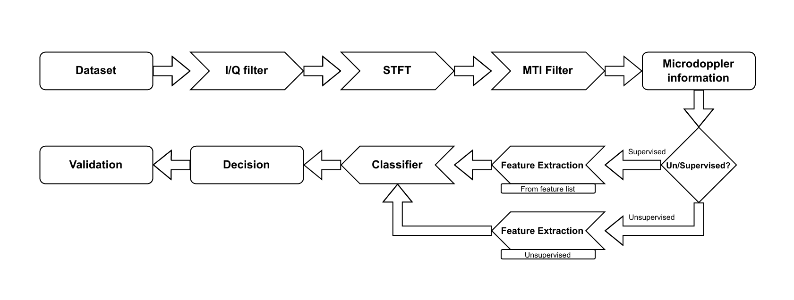

# EE4675 Object Classification with Radar

This repository contains the final project for the EE4675 course at TU Delft, focused on human activity classification using radar data and machine learning. Activities include walking, sitting, standing up, drinking, picking up an object, and falling.

## Overview

The final solution combines supervised and unsupervised features to achieve **94% classification accuracy** on the test set.

### Classification Report (Final Model)

| Activity       | Precision | Recall | F1-Score | Support |
|----------------|-----------|--------|----------|---------|
| Walking        | 1.00      | 1.00   | 1.00     | 62      |
| Sitting down   | 1.00      | 0.95   | 0.98     | 63      |
| Standing up    | 0.95      | 0.97   | 0.96     | 62      |
| Pick object    | 0.88      | 0.82   | 0.85     | 62      |
| Drink water    | 0.82      | 0.90   | 0.86     | 62      |
| Fall           | 1.00      | 1.00   | 1.00     | 40      |
| **Accuracy**   |           |        | **0.94** | 351     |
| **Macro avg**  | 0.94      | 0.94   | 0.94     | 351     |
| **Weighted avg** | 0.94    | 0.94   | 0.94     | 351     |

## Pipeline Overview

The following image illustrates the complete pipeline used in this project, from raw radar data processing to final activity classification.

## Main Notebooks

### `combining_and_training.ipynb`
This is the main notebook that combines the features from both the supervised and unsupervised approaches. It trains a neural network with cross-validation and achieves the final reported accuracy.

### `preproc_and_train.ipynb` and `training_with_embeddings.ipynb`
These notebooks train models on supervised and unsupervised features **separately**. They follow a similar structure to `combining_and_training.ipynb`, but only use one feature set.

## Feature Extraction

### `creating_embeddings_transfer_learning.ipynb`
Used to extract unsupervised features from radar spectrograms using transfer learning. We used the `google/vit-base-patch16-224` Vision Transformer model. This notebook may require significant computational resources—**we recommend running it on Google Colab with a GPU instance.**

Other pre-trained models are included in the notebook but were not used in the final model.

## Spectrogram Generation

### `ObjectClassification.ipynb`
This notebook implements radar signal preprocessing and spectrogram-based micro-Doppler analysis for human activity classification.

### `create_spectrograms.py`
Generates time-Doppler spectrograms from raw radar `.dat` files. These spectrograms are needed before you can run `creating_embeddings_transfer_learning.ipynb`.

**Requirements:** This script uses multiprocessing and can be resource-intensive. Make sure you have raw `.dat` radar files in a `datasets/` directory.

## Authors

- J.H.F. Jaspers - [j.h.f.jaspers@student.tudelft.nl](mailto:j.h.f.jaspers@student.tudelft.nl)
- W.P. de Bruin - [w.p.debruin@student.tudelft.nl](mailto:w.p.debruin@student.tudelft.nl)
- A. Acudad - [a.acudad@student.tudelft.nl](mailto:a.acudad@student.tudelft.nl)

Faculty of Electrical Engineering, Mathematics & Computer Science, TU Delft

---

